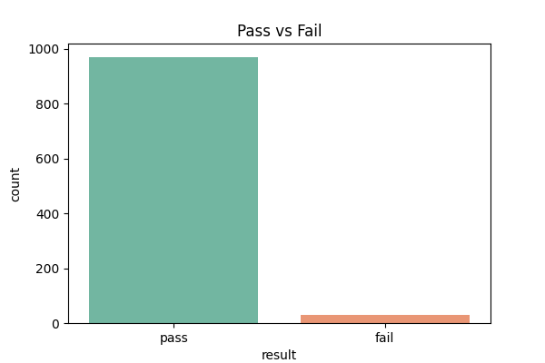
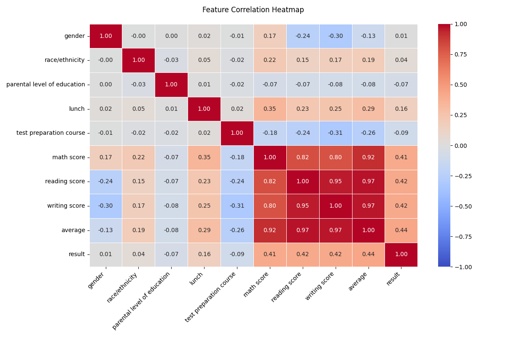
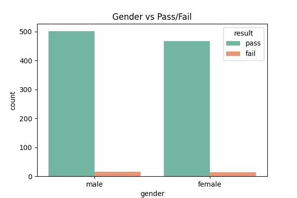

# 📊 Student Performance Prediction

## 📌 Overview

This project predicts whether a student will **pass or fail** using a **Random Forest Classifier** based on academic performance data.

---

## ⚙️ Workflow

* Data Loading
* Feature Engineering (average + result)
* Label Encoding
* EDA (charts & heatmap)
* Model Training
* Evaluation
* Hyperparameter Tuning

---

## 📊 Outputs

* `pass_vs_fail_chart.png`
* `gender_vs_pass_fail_chart.png`
* `correlation_heatmap.png`
* `Classification_Report.txt`

---

## Screenshots
<p align="center">
  
  
  
</p>

---

## ▶️ Run

```bash
pip install pandas seaborn matplotlib scikit-learn
python your_script_name.py
```

---
### 👩‍💻 Author: Maryam Yasha

